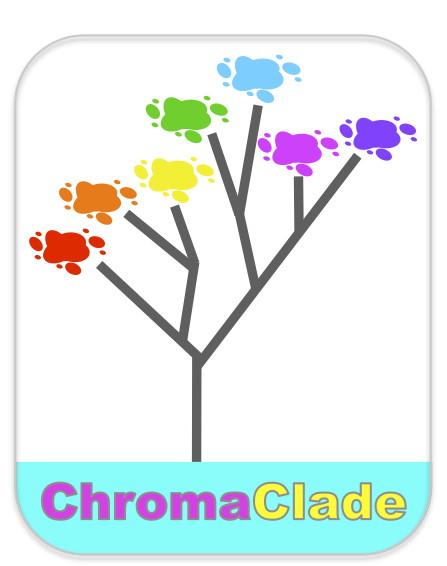
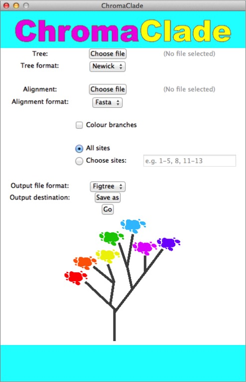
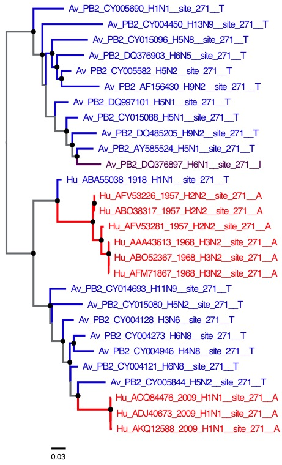

# ChromaClade

ChromaClade is a desktop bioinformatics application that produces visualisations combining sequence and phylogenetic data. It annotates taxon names in a phylogenetic tree with amino acids found at individual sites in a corresponding sequence alignment. Residue-specific colour codes enable easy inspection by eye and the resulting trees can be viewed in any of several popular tree-viewing programs.

This repository houses ChromaClade executables, documentation, example input/output and its source code. ChromaClade has been developed and distributed by Christopher Monit.

If you use ChromaClade please cite
> Monit, C., Goldstein, R. A. and Towers, G. J. (submitted) ChromaClade: Combined visualisation of phylogenetic and sequence data 

## Installation
Pre-compiled apps are available in the releases section above, for Windows and macOS:

**Windows:** download `chroma_clade.exe`.

**macOS:** download `Chroma.Clade.zip`. The app will be downloaded in a compressed file format; once it has downloaded just double click the file to access the app itself.

**Linux/Unix:** While no packaged application is currently available, the graphical interface can be run via the terminal, provided [Python 3](https://www.python.org/downloads/) and the Python modules [Biopython](https://pypi.org/project/biopython/)  and [PIL](https://pypi.org/project/Pillow/) are installed (`$ pip3 install biopython Pillow`). Download/clone this repository from the links above and then specify an alias command, for example:

`alias chroma_clade="python3 /path/to/chroma_clade/src/gui.py &"`

in the `~/.bashrc` file, or equivalent. See also the command line interface, below.

## Instructions
### Graphical interface

### Input
Use the buttons to select the files containing your tree and your corresponding alignment. 

Use the dropdown to select the **file format** for your input files: either [Newick](https://en.wikipedia.org/wiki/Newick_format) or [Nexus](https://en.wikipedia.org/wiki/Nexus_file) format for trees and [Fasta](https://en.wikipedia.org/wiki/FASTA_format) or Nexus format for alignment. Tools are available for converting between tree formats (e.g. [here](http://phylogeny.lirmm.fr/phylo_cgi/data_converter.cgi)) and alignment formats (e.g. [here](https://www.ebi.ac.uk/Tools/sfc/emboss_seqret/)).

The alignment would ordinarily be amino acid sequences (e.g. translated from the nucleotide sequences used to first estimate the tree) but the method will work perfectly well with nucleotide states too. 

### Output

The output is a set of trees saved to a single file, where taxon names have been annotated according to the amino acid found in that taxon's sequence. E.g. if methionine is found at position 1 in the human sequence, then 

> human

becomes

> human__site_1__M

In addition, the taxon name will be assigned a colour specific to methionine.

Use the dropdown to select the **output file format** for the output file, either a Nexus format file specifically compatible with the [FigTree](http://tree.bio.ed.ac.uk/software/figtree/) tree viewer, or the PhyloXML format compatible with other viewers such as [Archaeopteryx](https://sites.google.com/site/cmzmasek/home/software/archaeopteryx).

Click **Save as** to choose where to save the output.

### Options

Branches can also be coloured by amino acids observed in descendent taxa, by clicking the **Colour branches** checkbox. Annotated trees can be made for a subset of sites by clicking the **Choose sites** checkbox and entering the site ranges to include, just as you would specify pages of a document to print.

### Examples

An example dataset is given in `examples/`. These are sequences of the PB2 protein found in influenza A viruses infecting humans and birds. Below is a colour-annotated tree produced by ChromaClade and visualised in FigTree.

## Command Line Interface

ChromaClade also has a CLI (i.e. terminal-based interface) which should run on any system where [Python 3](https://www.python.org/downloads/) and [Biopython](https://pypi.org/project/biopython/) are installed.

Basic usage:

`$ cd chroma_clade/src`

`$ python3 chroma_clade.py <newick_tree_file> <fasta_alignment>`

For more information and options, run 

`$ python3 chroma_clade.py -h`

## License 

See `LICENSE.txt` file.

> This README.md is written with [StackEdit](https://stackedit.io/).
